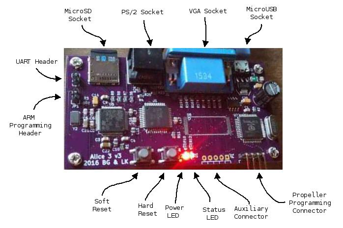

# Alice III

This is the third model of the Alice machine. It runs a silicon Z80 with
two co-processors: an ARM for keyboard, disk, and serial port, and a Propeller for video.

The 80MHz Propeller has 48K of internal RAM, drives VGA and the 5-pin Aux connector (intended for audio but wired generically to 3 Propeller pins) and thus provides opportunities for video and other experimentation.

The 168MHz STM32F415 ARM Cortex-M4 contains 192K of RAM and is connected to a PS/2 port, an SD card, and a simple UART on a 2-pin header, and has a firmware monitor that can be altered or replaced.

In the `kicad` directory are various schematics and PCBs. The latest is
`MOBO_SMD`, which uses surface mount versions of the parts.

To bring up a new board:

* Power:
    * Use a wall wart to provide micro-USB power. Verify that the D2 LED
      (closest to the switches) is on.  If you have an in-line USB
      current meter, there should be less than 10 mA being initially pulled.
      (More is pulled later when the board is fully brought up.)
* Propeller:
    * Hook up the Prop Plug. The Vss pin should be closest to the corner of
      the board.
    * Run PropellerIDE, load the `video_board/propeller/Main.spin` file,
      and program the EEPROM. After this you should be able to hook up a VGA
      monitor and see the line `Alice 3 GPU firmware`.
    * Remove the Prop Plug.
* Cortex-M4:
    * Connect your computer to the USB jack of the Alice III.
    * Short the header closest to the ARM, labeled "JP1".
    * Hard-reset the board (the push button closest to the LEDs).
    * Wait one second, then remove the jumper.
    * In `binaries`, run `sh install_cortex_m4_firmware.sh`.
        * The "dfu-util" program is a prerequisite.  It can be installed
	  on MacOS (our primary platform) through MacPorts as
	  `dfu-util`, or it can be compiled from the
          source at `git://git.code.sf.net/p/dfu-util/dfu-util`.
    * To interact with the boot monitor:
        * Locate the 2-pin header closest to the MicroSD socket.
          There's no label on this header.
        * Attach a serial transceiver to this header; transmit to the pin
          closest to the ARM, and receive from the other pin.
          E.g. connect FTDI Tx to the pin closer to the ARM and
          FTDI Rx to the pin further from the ARM.
        * Connect to the serial port at 115200 baud.
        * When you hard-reset or power-on the Alice III, you should see
          on the serial port "Alice 3 I/O firmware" followed by the
          firmware build date.
* Z80:
    * Format a MicroSD card for FAT32.
    * Copy `binaries/bootrom.bin`, `binaries/boot.dsk` and `binaries/disks.txt` to the MicroSD card.
    * Install the MicroSD card in the Alice III and power-on or hard-reset the Alice III.

